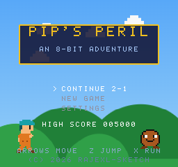
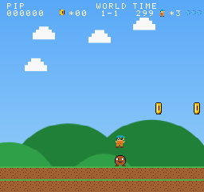

# Pip's Peril

**▶ [Play it in your browser](https://rajexl-sketch.github.io/pips-peril/)**

An original retro 8-bit side-scrolling platformer for the browser, built with
**Phaser 3 + TypeScript + Vite**. Every sprite, level layout, sound effect and
music track is generated procedurally from original data in this repository —
there are no external asset files and no copyrighted content.


| Title screen | Gameplay |
|---|---|
|  |  |

## The game

Guide **Pip** (teal cap, orange tunic) across the eight realms to topple
**King Grum**:

| World | Name | Theme |
|---|---|---|
| 1 | Verdant Vale | Grassland |
| 2 | Echo Caverns | Underground cave |
| 3 | Cloudreach | Sky platforms |
| 4 | Gloamwood | Night forest |
| 5 | Mistmarsh | Water / swamp |
| 6 | Granite Keep | Fortress |
| 7 | Cinder Steppes | Lava fields |
| 8 | The Molten Throne | Final gauntlet |

4 stages per world (32 levels). Every world ends in a fortress with a
King Grum battle that scales in HP and aggression.

### Features

- **NES-feel movement**: acceleration, run/walk tiers, skid turnaround,
  variable-height jumps (release to cut), coyote time, jump buffering,
  momentum preserved in the air — tuned for speedrunning.
- **Enemies**: Bloop (walker), Flit (flyer), Sheldon (kickable shell beetle),
  Springle (hopper), Rammet (charger), Spitterbud (projectile flower),
  King Grum (multi-phase boss). Patrol AI, edge detection, stomps, knockback.
- **Power-ups**: Juniper Berry (growth), Ember Fruit (spark projectiles),
  Bubble (shield), Swift Boots (speed), Featherleaf (double jump),
  Sprout (1-up).
- **Level elements**: breakable bricks, question blocks, hidden blocks,
  springs, ladders, warp pipes, doors and keys, spikes, water and lava,
  moving and falling platforms, checkpoints, secret bonus rooms, a hidden
  warp room in 1-2, and 3 hidden gems per level.
- **Audio**: WebAudio chiptune synth emulating the NES channel layout
  (2 pulse + triangle + noise). Nine original looping tracks plus jingles
  and ~20 synthesized sound effects.
- **Systems**: lives, coins-for-life, score + high score, level timer with
  hurry warning, checkpoints, save/continue via localStorage.
- **UX / accessibility**: pause, settings, full key remapping, gamepad
  support, on-screen touch controls on mobile, three difficulty levels,
  volume sliders, high-contrast mode.

## Controls (default)

| Action | Key |
|---|---|
| Move | Arrow keys |
| Jump (hold for height) | Z |
| Run / fire spark | X |
| Enter pipe / door | Down / Up |
| Pause | Enter |

All keys are remappable in **Settings**. Gamepads: D-pad/stick to move,
A/B jump, X/Y run.

## Setup

```bash
npm install
npm run dev        # dev server at http://localhost:5173
```

## Build & test

```bash
npm run build      # typecheck + production bundle in dist/
npm run preview    # serve the production build locally
npm test           # vitest unit tests (audio, save system, level parser)
npm run typecheck  # tsc --noEmit only
```

## Deployment

The production build is a fully static site (one HTML file + one JS bundle).
Host `dist/` on any static host:

- **Azure Static Web Apps**: point the app artifact location at `dist/`.
- **GitHub Pages / Netlify / Vercel**: publish the `dist/` directory.
- `vite.config.ts` uses `base: './'`, so it works from any sub-path.

## Architecture

```
src/
  main.ts                  Phaser game config (256x240 internal, pixel-perfect)
  core/constants.ts        All physics/game-rule tuning in one place
  gfx/
    render.ts              ASCII-grid -> canvas texture renderer
    font.ts                Original 5x7 bitmap font -> Phaser RetroFont
    TextureFactory.ts      Builds every texture/animation + parallax backdrops
    art/                   Pixel art as string grids (player/enemies/tiles/items)
  audio/
    notes.ts               Pure music notation parser (unit tested)
    Chiptune.ts            WebAudio synth: look-ahead sequencer, 4 channels
    tracks.ts              Original compositions
    Sfx.ts                 Synthesized sound effects
  systems/
    SaveSystem.ts          localStorage persistence (validated, injectable)
    GameState.ts           Run-time session state (lives/score/power)
    InputManager.ts        Keyboard + gamepad + touch behind one action API
  entities/
    Player.ts              Movement state machine and power states
    enemies/               Enemy base class + 6 types + boss state machines
  levels/
    chunks.ts              Original 15-row terrain strips (the level DNA)
    LevelBuilder.ts        Pure parser: chunks -> tile grid + placements
    levels.ts              32 level recipes with difficulty tiers
  scenes/                  Boot/Title/LevelIntro/Game/UI/Pause/Settings/...
tests/                     vitest suites for notes, saves, chunks, all 32 levels
```

Key decisions:

- **Everything procedural.** Sprites are ASCII grids rendered to canvas
  textures at boot; backgrounds are drawn with seeded RNG; music is note
  data fed to a WebAudio scheduler. The repo is 100% text.
- **Pure logic cores.** The level parser, music notation, and save system
  have no Phaser imports, so they run under vitest in Node.
- **Palette swaps, the NES way.** One terrain grid serves seven world themes;
  Pip's spark form is the same art with a different palette.
- **Chunk-based levels.** Stages are assembled from an original chunk library
  with per-world difficulty tiers, then parsed into a collision tilemap and
  object placements. Sub-areas (bonus rooms, the warp room) live in the same
  tilemap with separate camera bounds.

## Originality statement

All character designs, names, level layouts, music, and sounds in this
project are original works created for Pip's Peril. The game pays homage to
the *genre* of 1980s platformers without reproducing any specific
copyrighted character, asset, layout, or composition.

## License

Copyright © 2026 rajexl-sketch. Licensed under the
[PolyForm Noncommercial License 1.0.0](LICENSE): you are welcome to play,
read, learn from, and share this project for **noncommercial** purposes.
Any commercial use of the game, its code, characters, art, or music
requires separate written permission from the copyright holder — see
[NOTICE](NOTICE) for details.
